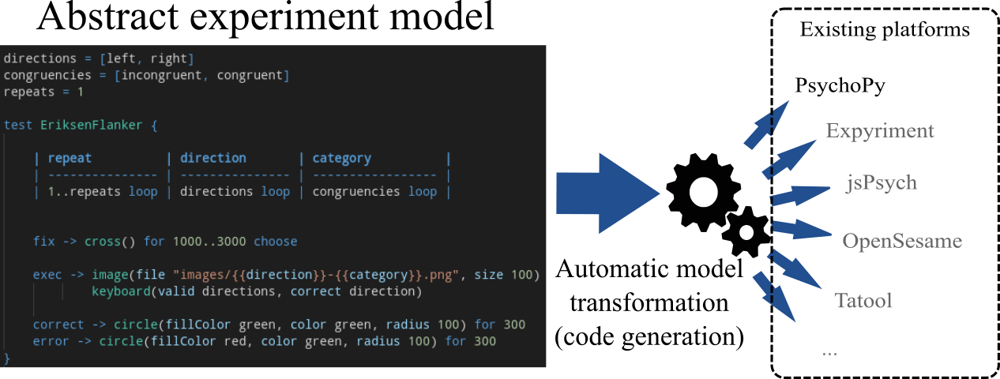
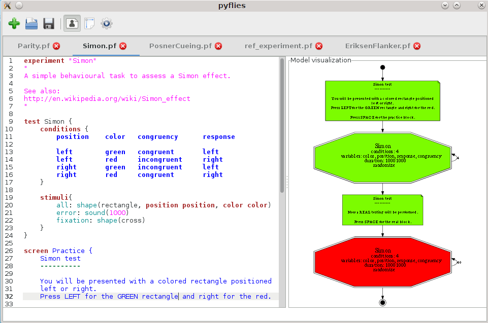

 

# pyFlies

A Domain-Specific Language (DSL) for designing experiments in psychology

---

[pyFlies](https://github.com/pyflies/pyflies/) is a language tailored for
designing of experiments in psychology. These kind of languages are often called
Domain-Specific Languages - DSLs. 

The aim of the language is to be highly readable and simple to learn and to
focus on capturing the essence of the experiment while leaving the details to
the compiler/code generator.

A code for various run-time platforms can be generated from the experiment
description. Currently [PsychoPy](https://www.psychopy.org/) is fully supported
and we plan to build generators for other targets.

**Features:**

 * High-level. Easy to write and read. Experiments can be defined in minutes.
 * From experiment description a source code for various platforms can be
   automatically generated. 
 * Declarative language. Specify `what` needs to be done and leave `how` part to
   the pyFlies compiler.
 * Integrates in [VS Code](https://code.visualstudio.com/), one of the most
   popular code editor today with a huge number of extensions for all sorts of
   file editing tasks.
 * Written in Python programming language. Easy to extend. Generators are
   plugins which can be developed independently.
 * Fully free and open source. GPL license. [Hosted on
   github](https://github.com/pyflies/pyflies). Easy to contribute to.
   Contributions are welcomed!

## Overview video

Click on the image bellow to see a short (~3 min) overview video. For a longer
introduction please see tutorial videos.

## Getting started

### Installation

Install [Python](https://www.python.org/) and check that it is available on the
command line by running:

    python --version

It is recommended to use [Python virtual
environments](https://docs.python.org/3/library/venv.html) to isolate different
set of Python libraries. Create virtual environment for pyFlies by running:

    python -m venv pyflies-venv
    
This will create folder `pyflies-venv` where your libraries will be installed.

You need to activate virtual environment before usage:

    source pyflies-venv/bin/activate    (for Linux and other POSIX systems)
    pyflies-venv\Scripts\activate.bat    (for Windows)

Now, you can install pyFlies and generator for PsychoPy with:

    pip install pyflies-psychopy

To verify that pyFlies is installed you can run:

    textx list-generators
    
You can see in the output that [the generator pyflies ->
psychopy](generators.md) is available.

pyFlies specifications are pure text and can be edited by any textual editor but
for a good experience (especially with tables) it is recommended that pyFlies
extension for VS Code is used.

Install VS Code either for you OS package manager or by going to [VS Code
download page](https://code.visualstudio.com/download) and downloading package
for your operating system. In the list of extensions find pyFlies and click on
`install`.

!!! note

    In order to run your experiments you need to install software for the target
    platform you want to generate code for (currently
    [PsychoPy](https://www.psychopy.org/) only).

!!! note

    You can watch the process of installation in 
    [this video](https://www.youtube.com/watch?v=NVB2JHbCLY0). In the video we 
    are using Linux but most of the information is valid for other OSes.

### Video tutorials

The best way to start with pyFlies is by watching some of [our video
tutorials](https://www.youtube.com/playlist?list=PLOgHC04drILVjnXQTFEL7sJDyfKMR21Vg).

### Try examples

Clone or [download](https://github.com/pyflies/pyflies/archive/main.zip)
[pyFlies repo](https://github.com/pyflies/pyflies). Unpack and load examples
from `examples` folder in the VS Code editor. Update experiment definition to
your taste. Generate and run experiment.

### Planned features

Besides language improvement which we are constantly work on, there are two
bigger features that will greatly improve overall user experience in working in
the pyFlies editor:

- Running generators from the context menu in VS Code and getting feedback and
  errors.
- "Smart" code-completion and code navigation. Currently, we provide only code
  snippets which can help a lot but implementing [Language Server
  Protocol](https://microsoft.github.io/language-server-protocol/) for pyFlies
  we can get much better editing experience. For example, when you type `exec ->
  ` editor can offer just the components, or when you are inside the component
  parameters editor can offer just the parameters for that component (without
  those that are already specified) with explanation extracted from the
  component description in the tooltip. Furthermore, navigation will enable to
  click on a variable and jump to its definition.

### Discuss, ask questions

For all questions, ideas, feature requests and bug report please use [the GitHub
issue tracker](https://github.com/pyflies/pyflies/issues).

## Screenshots (click for a popup)

### Editing specification

Experiment is created and modified in a convenient to use editor.

### Generated log

From an experiment specification a full log of the experiment flow is generated
which can be used to investigate and debug the experiment.

### Generated PsychoPy code

From an experiment specification Python code for PsychoPy is generated which is
used to run the experiment.

pyFlies icon is based on an icon licensed by CC BY 3.0 from [Icon Fonts](http://www.onlinewebfonts.com/icon).
