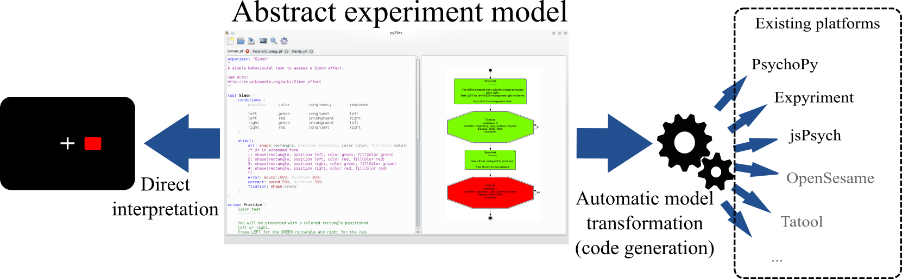

# pyFlies

A Domain-Specific Language (DSL) for cognitive experiments modeling.

---

[pyFlies](https://github.com/igordejanovic/pyFlies/) is a Domain-Specific
Language (DSL) for cognitive experiments modeling. It is meant to be highly
readable and simple to learn.

A code for various run-time platforms can be generated from the experiment
description. Futhermore, model can be directly interpreted if the run-time
supports pyFlies.

**Features:**

 * Based on the condition-stimuli-response paradigm.
 * High-level. Easy to write and read. Experiments can be defined in minutes!
 * From experiment description a source code for various platforms can be
   automatically generated. Check out generators. If you don't find one you need
   consider writing one.
 * Declarative language. Specify `what` needs to be done and leave `how` part to the pyFlies.
 * GUI editor with syntax highlighting and experiment structure visualization.
 * Written in Python programming language. Easy to extend.
 * Fully open source. GPL license.
   [Hosted on github](https://github.com/igordejanovic/pyflies). Easy to contribute to.

## Getting started

### Prerequsites

To install pyFlies you will need to install following dependencies:

- Mandatory:

    * [Python](https://www.python.org/)
    * [textX](https://github.com/igordejanovic/textX) - will be installed
      automatically if `pip` is used.
    * [jinja2](http://jinja.pocoo.org/) - for generating source code. Will be
      installed automatically if `pip` is used.

- Optional. Needed if GUI is used:

    * [Qt 4.8](http://www.qt.io/developers/) - GUI library.
    * [pyQt4](http://www.riverbankcomputing.co.uk/software/pyqt/intro) - Python
      binding for Qt.
    * `dot` (part of [GraphViz](http://www.graphviz.org/)) - `dot` must be on your
      `PATH` for model visualization.

It is planed to make installers for different platforms available in the future.
If you want to contribute installer for some platform please se section
`Contributions`.

### Installation

Install `Python` and `pip` tool.

Current stable version of pyFlies can be installed using `pip` installer:

    pip install pyFlies

The development version can be installed with:

    pip install https://github.com/igordejanovic/pyFlies/archive/master.zip

For GUI use download and install optional dependencies.

### Quick start

1. Start pyFlies GUI. GUI doesn't need to be used. You can also use any text
   editor to write your models.

        pyfliesgui

2. Open new file (e.g. simon.pf) and write your test description:

        experiment "Simon"
        "
        A simple behavioural task to assess a Simon effect.

        See also:
        http://en.wikipedia.org/wiki/Simon_effect
        "

        test Simon {
          conditions {
            position  color   congruency    response

            left      green   congruent     left
            left      red     incongruent   right
            right     green   incongruent   left
            right     red     congruent     right
          }

          stimuli{
            all: shape(rectangle, position position, color color)
            error: sound(1000)
            fixation: shape(cross)
          }
        }

3. Add screen definitions:

        screen Practice {
          Simon test
          ----------

          You will be presented with a colored rectangle positioned
          left or right.
          Press LEFT for the GREEN rectangle and right for the red.

          Press SPACE for the practice block.
        }

        screen Real {
          Simon test
          ----------

          Now a REAL testing will be performed.

          Press SPACE for the real block.
        }

    Screen definitions are instructions which are presented to the subject
    in between trial series.

4. Define the structure of the experiment:

        structure {
          screen Practice
          test Simon 1 practice randomize
          screen Real
          test Simon 10 randomize
        }

    The structure gives the order and structure of experiment elements
    execution. In its most basic form, shown here, it instantiates screens and
    tests in the right order. In this experiment, first a `Practice` screen will
    be displayed. After the user press *ENTER* key a test execution will be
    performed for `1` set of trials (a set consists of application of all
    possible conditions). In this example, there is `4` possible conditions thus
    this serie will have `4` trials. This trial serie will be of practice type
    which means that it will be removed from the results. A set of conditions
    will be `randomized`. After the `Practice` serie a `Real` screen
    will be displayed and after the *ENTER* key press a real serie will be
    performed by a `10` complete repetition of all `4` condition (i.e. a `40`
    trials). The trials will be `randomized`.

    At this point an experiment is fully described but to be usable we have to
    generate the code for the target platform.

5. Configure target generator:

        target PsychoPy {
          output = "/home/igor/Simon/"
          responses {
            left = left
            right = right
          }

    This specification defines that `PsychoPy` target library is used. The
    output folder where code should be generated is set. `responses` section
    maps abstract responses keywords (from the `conditions` section) to the
    platform specific responses (e.g. keys, buttons).

    Multiple target configurations can be specified. At the time of this writing
    only `PsychoPy` is completed but work is under way to support other
    platforms (e.g. Expyriment, jsPsych...).

6. Generate source code for the target platform. This can be done from the
   command line using `pyflies` tool.

        $ pyflies simon.pf
        Generating code for target PsychoPy(out=/home/igor/Simon/)...Done
        Code for target platform(s) generated sucessfully.

   Code generation can also be done from the pyFlies GUI using `Generate code`
   button.
   
   The generator will produce code for you experiment and the configured target
   platform.

7. Run the experiment using target platform and gather data.

        $ cd ~/Simon/
        $ python2 simon.py

   Note that PsychoPy, which is used in this introduction, must be installed.

### Try examples

Clone or [download](https://github.com/igordejanovic/pyFlies/archive/master.zip)
pyFlies repo. Unpack and load examples from `examples` folder in the editor or
pyFlies GUI. Update experiment definition to your taste (at least update
`target` output specification). Generate and run experiment.

### Discuss, ask questions

Please use [discussion
forum](https://groups.google.com/forum/?hl=en#!forum/pyflies) for general
discussions, suggestions etc.

If you have some specific question on textX usage please use
[stackoverflow](http://stackoverflow.com/). Just make sure to tag your question
with `pyflies`.

## Screenshots

## Credits

pyFlies icon is based on [Icon Fonts](http://www.onlinewebfonts.com/icon) licensed by CC BY 3.0.
