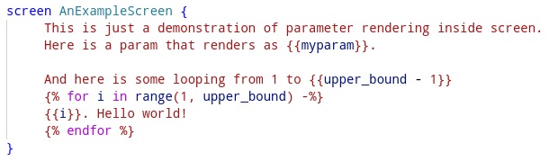

# Screens

---

Screens are used to display instructions to the subject.

Here is an example of a screen definition:

    screen Intro {
        Parity classification
        ---------------------

        This is a practice block.

        You will be presented with a digit.
        Press LEFT for odd and RIGHT for even digit.

        Press ENTER key for the start.
    }

Each screen starts with a keyword `screen` after which we give a unique name for
the screen which is used in `show` statements in the [`flow`
definition](flow.md). The screen content is enclosed in curly braces.

Most of the time screen content is just a plain static text but sometimes we
need to show screen multiple times to the subject which contains almost the same
content but with a slight changes. 

To support dynamic parts of the screen content it is piped through [Jinja
template engine](https://jinja.palletsprojects.com/) and thus can contain
variable parts which are filled when [the screen is
displayed](flow.md#showing-screens).

For example:

As you can see we have used two variables in the screen definition: `myparam`
and `upper_bound`. These variable can be defined globally at the beginning of
the experiment or can be passed as arguments when [the screen is
displayed](flow.md#showing-screens) like:

    show AnExampleScreen(myparam hello, upper_bound 10)

The screen will be rendered as:

    This is just a demonstration of parameter rendering inside screen.
    Here is a param that renders as "hello".

    And here is some looping from 1 to 9
    1. Hello world!
    2. Hello world!
    3. Hello world!
    4. Hello world!
    5. Hello world!
    6. Hello world!
    7. Hello world!
    8. Hello world!
    9. Hello world!

Special syntax used to interpolate variable part (`{{}}`, ``
etc.) is defined by Jinja template engine end the full documentation is
[available on the project site](https://jinja.palletsprojects.com/).
